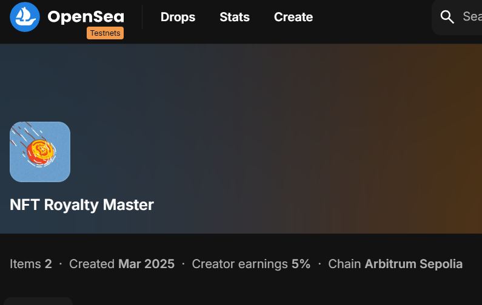

# 🏆 NFT Royalties Mastery

ERC721 practice repository featuring a smart contract that creates unique NFTs integrating IERC2981 royalties The NFTs can be visualized on OpenSea and in your MetaMask wallet.



## 🔍 Check NFT Collection

- **Arbiscan:** [View and interact with the contract](https://sepolia.arbiscan.io/address/0xA4b3f7783E1a48A5D06df273Ba00D7F6D40B0291) on Arbiscan.
- **OpenSea:** [Browse the NFT collection](https://testnets.opensea.io/collection/nft-royalty-master) on OpenSea.
- **MetaMask:** Add the contract address to your MetaMask wallet to view your NFTs.

---

## ✨ Key Features

| **Feature**       | **Description**                                                                                        |
| ----------------- | ------------------------------------------------------------------------------------------------------ |
| Unique NFTs       | Each NFT in the "NFT Royalties Mastery" collection has unique metadata and an associated image.        |
| IPFS Integration  | Images and JSON metadata are stored on IPFS using Pinata, ensuring decentralized and reliable storage. |
| Verified Contract | The smart contract is verified on Arbitrum, ensuring transparency and security. 
| Mint Price   | To mint the nft a price of 0.0001 eth needs to be paid.                        |
| Royalty Support   | Integrated EIP-2981 royalties ensure creators receive a percentage of secondary sales.                 |
| Easy Interaction  | Interact with the contract directly via Foundry or through Arbiscan.                                   |

---

## 📊 Contracts Overview

### `NftRoyalties.sol`

This ERC721 NFT contract defines the core functionality of the NFT Royalties Mastery collection and includes EIP-2981 royalty functionality.

| **Function**                                | **Description**                                                                               |
|---------------------------------------------|-------------------------------------------------------------------------------------------------|
| `constructor(string memory name_, string memory symbol_, string memory _baseUri)` | Deploys the NFT collection with a specified name, symbol, and base URI for metadata storage.     |
| `mint()`                                    | Allows users to mint a new NFT if the total supply limit is not reached and the correct fee is paid. |
| `tokenURI(uint256 tokenId)`                 | Returns the metadata URI for a given token ID by appending it to the base URI.                   |
| `royaltyInfo(uint256 , uint256 salePrice)`  | Returns the royalty recipient's address and calculated royalty amount for secondary sales.        |
| `withdrawEth()`                             | Allows the royalty recipient to withdraw collected eth from minting.                |
| `supportsInterface(bytes4 interfaceId)`     | Ensures compatibility with ERC721, ERC2981, and other supported interfaces.                        |

### `NftRoyaltiesScript.sol`

This deployment script deploys the NFT Royalties contract with specified parameters.

| **Function**                                | **Description**                                                                               |
|---------------------------------------------|-------------------------------------------------------------------------------------------------|
| `run()`                                     | Deploys the `NftRoyalties` contract with defined parameters for name, symbol, and base URI.    |

### `MintNftRoyaltiesScript.sol`

This minting script allows you to mint new NFTs from an existing deployed contract.

| **Function**                                | **Description**                                                                               |
|---------------------------------------------|-------------------------------------------------------------------------------------------------|
| `run()`                                     | Mints a new NFT by interacting with the deployed `NftRoyalties` contract.                         |

---

## 🛠️ Deployment

To deploy the contract using Foundry:

1. Install Foundry (if not already installed):
   ```bash
   curl -L https://foundry.paradigm.xyz | bash
   foundryup
   ```
2. Add your `.env` file with the following keys:
   ```env
   NFT_CONTRACT=0xYourDeployedContractAddress
   PRIVATE_KEY=0xYourPrivateKey
   ```
3. Deploy the contract with:
   ```bash
   forge script script/DeploymentScript.s.sol --broadcast --rpc-url https://arbitrum-rpc-url
   ```
4. Verify the deployment on Arbiscan and interact with the contract directly.

